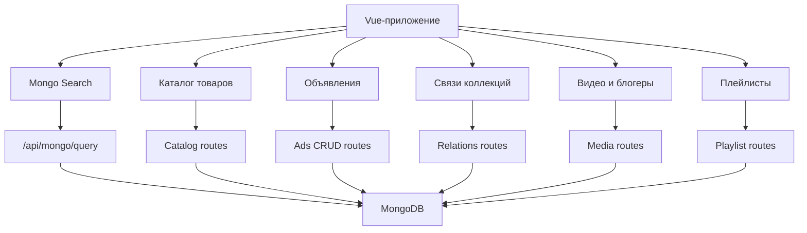

<div align="center">

# MongoDB Practice Hub
### Единый учебный fullstack-портал по MongoDB, Express, Mongoose и Vue

Практический проект для изучения MongoDB через реальный сайт: поиск по базе, каталог товаров, объявления, связи коллекций, видео, блогеры и плейлисты.

---

[](https://github.com/DIBERLOG/MongoDB-Practice-Hub)
[](https://nodejs.org/)
[](https://www.mongodb.com/)
[](https://vuejs.org/)
[](./package.json)

</div>

---

## Основные возможности

- Безопасный поиск по MongoDB прямо из браузера.
- Два режима поиска: простой поиск через форму и JSON-поиск как в MongoDB Compass.
- Работа с коллекциями `actors` и `cities` с ограничением `limit <= 100`.
- Каталог товаров с фильтрацией, сортировкой, страницей товара и блоком "Супер-цена".
- Раздел связей между коллекциями: `users`, `orders`, `products`.
- Доска объявлений с CRUD: создание, просмотр, редактирование и удаление.
- Валидация объявлений через Mongoose и понятные сообщения об ошибках.
- Раздел видео и блогеров с рекомендациями, страницами авторов и поддержкой `v-html` для YouTube.
- Плейлисты блогеров и фильтрация видео по автору и плейлисту.
- Единый Vue-интерфейс и один Express-сервер.

---

## Технологический стек

| Раздел | Технологии |
|--------|------------|
| Frontend | Vue 3, Vue Router, CSS |
| Backend | Node.js, Express |
| База данных | MongoDB, Mongoose |
| API | REST endpoints, JSON |
| Сборка | Vite |
| Утилиты | CORS, Nodemon |

---

## Структура проекта

```text
MongoDB-Practice-Hub/
├── server/
│   ├── data/
│   ├── models/
│   ├── routes/
│   ├── utils/
│   └── index.js
├── src/
│   ├── components/
│   ├── pages/
│   ├── api.js
│   ├── App.vue
│   ├── main.js
│   ├── router.js
│   └── styles.css
├── public/
├── index.html
├── package.json
└── vite.config.js
```

---

## Разделы сайта

### Mongo Search

Страница `/mongo-search` позволяет искать документы в MongoDB без MongoDB Compass.

Поддерживается:
- выбор коллекции;
- простой поиск по полям;
- JSON-поиск через `filter`, `sort`, `limit`;
- вывод количества найденных документов;
- таблица результатов;
- защита через whitelist коллекций.

### Каталог товаров

Раздел показывает работу с товарами:
- список товаров;
- фильтр по категории;
- сортировка по цене;
- страница одного товара;
- подборка товаров со скидкой.

### Объявления

Полноценный CRUD-раздел:
- создание объявления;
- редактирование;
- удаление;
- просмотр одного объявления;
- поиск и фильтрация;
- "Мои объявления";
- дефолтная картинка;
- Mongoose-валидация.

### Связи коллекций

Учебный пример, где сервер берёт заказ, затем по данным заказа находит пользователя и товар, после чего собирает единый объект для отображения на сайте.

### Видео, блогеры и плейлисты

Медиа-раздел показывает:
- топ видео по лайкам;
- страницу одного видео;
- рекомендации от того же автора;
- страницу блогера;
- сортировку видео блогера;
- плейлисты;
- отображение YouTube iframe через `v-html`.

---

## API

| Метод | Адрес | Назначение |
|------|-------|------------|
| POST | `/api/mongo/query` | Безопасный поиск по MongoDB |
| GET | `/api/products` | Список товаров |
| GET | `/api/product` | Один товар |
| GET | `/api/products/discount` | Товары со скидкой |
| GET | `/api/orders/summary` | Связи между коллекциями |
| GET | `/api/ads` | Список объявлений |
| GET | `/api/ads/my` | Мои объявления |
| GET | `/api/ad` | Одно объявление |
| POST | `/api/ads` | Создать объявление |
| PUT | `/api/ads` | Обновить объявление |
| DELETE | `/api/ads` | Удалить объявление |
| GET | `/api/videos` | Список видео |
| GET | `/api/video` | Одно видео |
| GET | `/api/blogger` | Страница блогера |
| GET | `/api/playlists` | Плейлисты блогера |
| GET | `/api/playlist` | Видео плейлиста |

---

## Запуск проекта

Перед запуском должна быть установлена и запущена локальная MongoDB.

```bash
npm install
npm run build
npm start
```

После запуска сайт будет доступен по адресу:

```text
http://localhost:3100
```

Проверка сервера:

```text
http://localhost:3100/health
```

---

## Диаграмма структуры



---

<div align="center">

Проект создан как учебный fullstack-практикум по MongoDB, Express, Mongoose и Vue.

</div>
